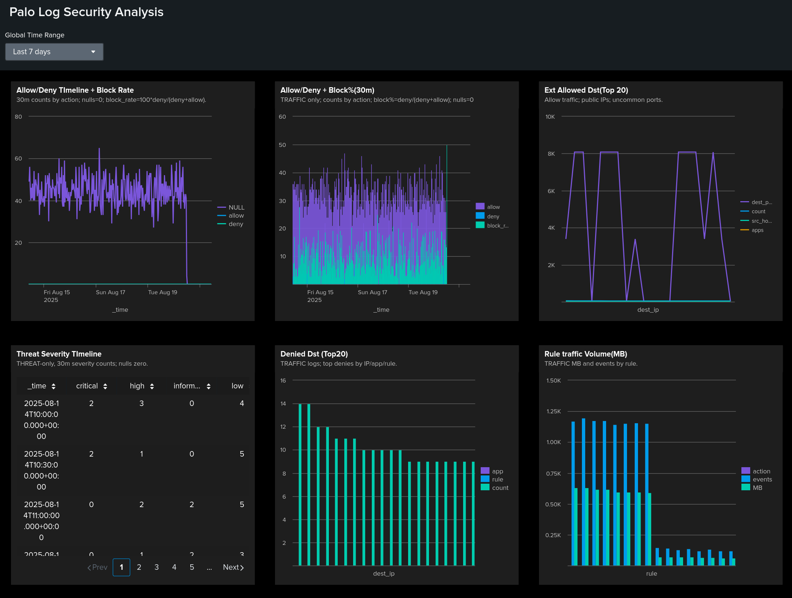

# Splunk Palo Alto Log Security Analysis

Palo Alto case in Splunk: 6 checks + a dashboard for rapid triage of block rate, denied destinations, external uncommon ports, threat-severity spikes, and high-volume rules. Structure and delivery mirror the referenced repo.

**Files**
- Full report (DOCX): **[Palo_Logs_report.docx](Palo_Logs_report.docx)**
- Dashboard (PNG): **[Dashboard_palo.png](Dashboard_palo.png)**

---

## Data and Fields
Palo Alto **TRAFFIC** and **THREAT** logs in Splunk.  
Key fields (parsed from `_raw` via inline regex where needed): `action`, `src_ip`, `dest_ip`, `src_port`, `dest_port`, `app`, `rule`, `severity`, `bytes_total`, `bytes_sent`, `bytes_recv`.  
Default time range: last 24 hours.

---

## Dashboard

**Purpose.** One screen to spot block-rate shifts, risky egress on non-standard ports, repeated denies, severity bursts, and top-talker rules.  
**Global filters.** Time range. Panels update in sync.

**Panels**
1. **Allow/Deny Timeline + Block rate** — stability vs spikes.  
2. **TRAFFIC: Allow/Deny + Block% (30m)** — validates action parsing on TRAFFIC only.  
3. **Ext Allowed Destinations (Top 20)** — Internet egress on uncommon ports to public IPs.  
4. **Threat Severity Timeline** — informational→critical trends.  
5. **Denied Destinations (Top 20)** — repeated denies by destination/app/rule.  
6. **Rule Traffic Volume (MB)** — events and MB by rule and action.

**KPIs/thresholds.**
- Block rate: baseline + **2σ** for alerting.  
- External egress: allows to public IPs on non-standard ports.  
- Threats: repeated **high/critical** within 1 hour.  
- Policies: skewed MB to few broad rules.

---

## Checks and Findings

### 1) Block Rate Over Time
**Purpose:** Establish allow/deny baseline and compute block rate.  
**Finding:** Short deny spikes on a stable baseline.  
**Recommendation:** Alert on >2σ deviation; correlate with rule/content updates.

### 2) TRAFFIC-Only Trend with Explicit Action Parsing
**Purpose:** Reduce noise and validate action parsing.  
**Finding:** Trend matches Check 1; gaps imply mixed/unparsed events.  
**Recommendation:** Normalize `action` at ingest; add sourcetype parsing tests.

### 3) Top Denied Destinations, Apps, and Rules
**Purpose:** Triage noisy paths and close policy gaps.  
**Finding:** Denies cluster on a few `dest_ip/app/rule` combos.  
**Recommendation:** Allow legitimate flows, fix routing, hard-block risky targets.

### 4) Allowed Outbound to External Non-Standard Ports
**Purpose:** Expose risky egress beyond 80/443/53/123.  
**Finding:** Allows to public IPs on uncommon ports from limited sources.  
**Recommendation:** Justify each case; narrow by app/subnet/time; add IDS signatures.

### 5) Threat Severity Trend Over Time
**Purpose:** Detect detection bursts and tune thresholds.  
**Finding:** Clustered **high/critical** windows.  
**Recommendation:** Correlate with EDR/IDS and change calendar; auto-ticket repeats.

### 6) Data Volume by Policy Rule and Action
**Purpose:** Identify top-talker rules and validate legitimacy.  
**Finding:** MB skewed to a few broad policies.  
**Recommendation:** Confirm ownership; split broad rules; enforce least privilege and tighter egress controls.

---

## Result
A repeatable Splunk workflow for Palo Alto logs. Six targeted checks plus a dashboard enable fast triage, clear thresholds, and actionable steps. Full steps with screenshots are in **Palo_Logs_report.docx**. Visual summary is **Dashboard_palo.png**.
